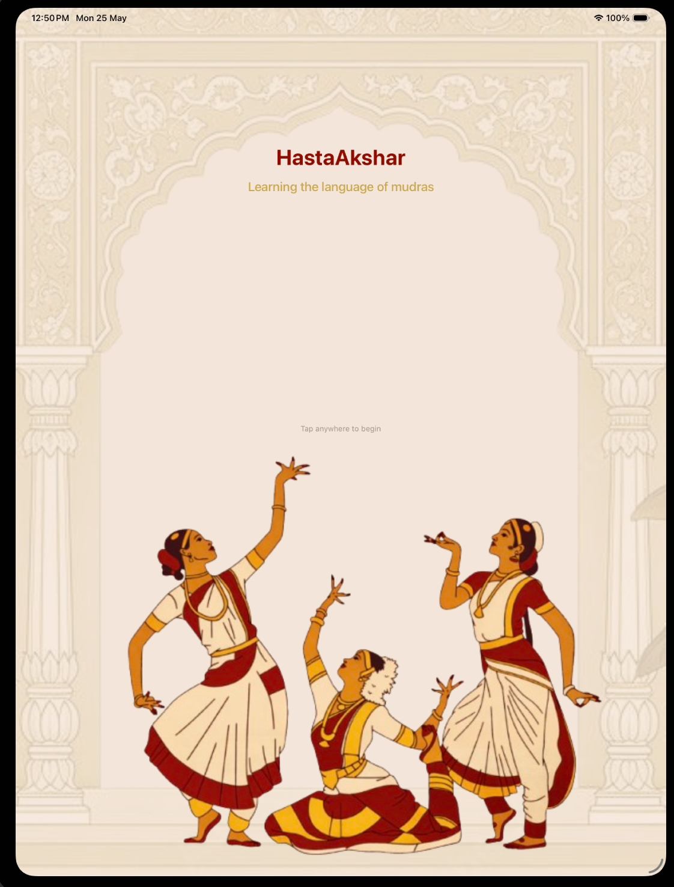
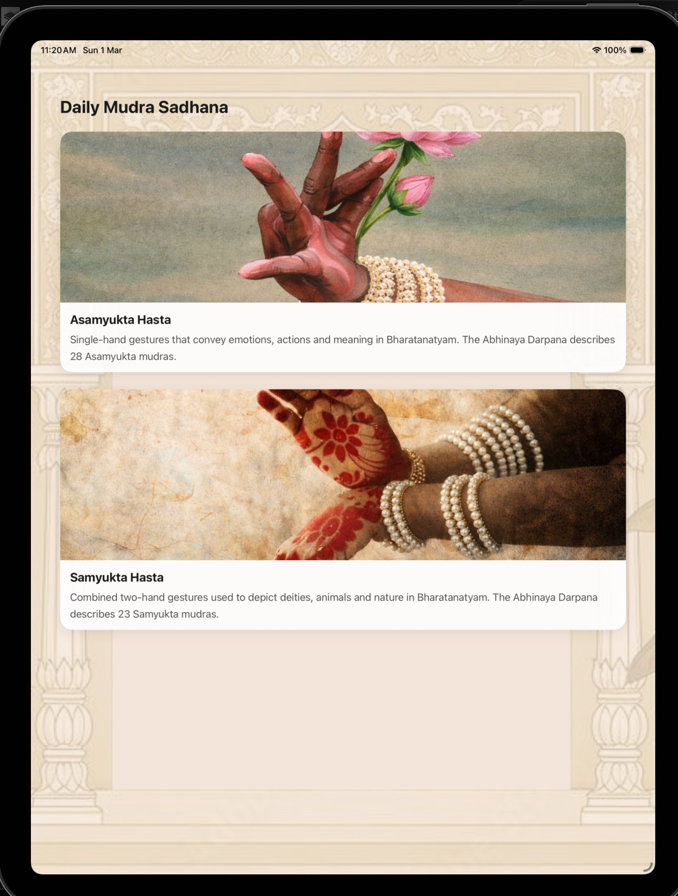
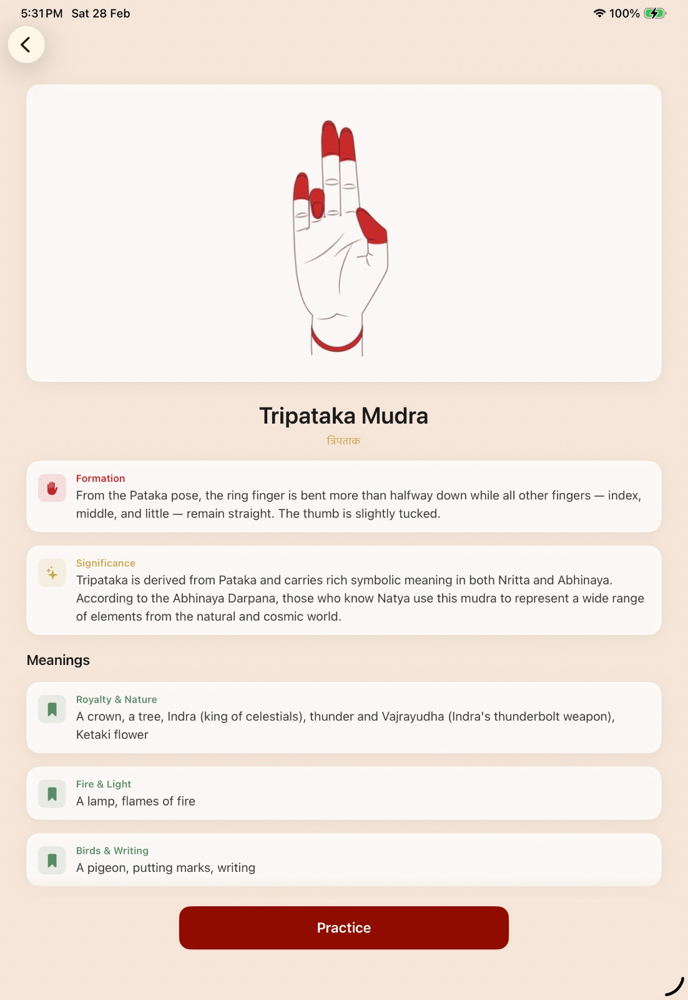
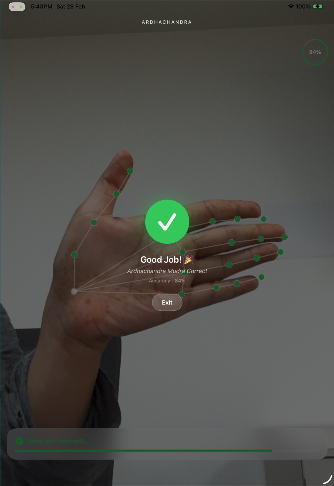

# HastaAkshar 🪷

**Learning the language of mudras**

HastaAkshar is an interactive iOS/iPadOS application designed to gamify the experience of learning and practicing Bharatnatyam mudras. Built with love and passion, it was originally submitted as a part of the Swift Student Challenge 2026. 

## 📖 The Story Behind HastaAkshar
I did Bharatnatyam for over 6 years of my life. I really struggled with remembering the sequence of mudras and their significance in the Natyashastra. So I wanted to build a tool which would gamify the experience and would be helpful in learning along with practicing the form of mudras—both double and single hand gestures.

HastaAkshar transforms the traditional, often challenging process of memorizing mudras into an engaging, interactive journey. It bridges ancient art with modern technology, helping dancers and enthusiasts alike perfect their gestures.

## ✨ Features
- **Comprehensive Library:** Explore both Asamyukta Hasta (single-hand gestures) and Samyukta Hasta (combined two-hand gestures).
- **In-Depth Knowledge:** Learn the detailed formation, significance, and various meanings of each mudra according to the Abhinaya Darpana.
- **Interactive Practice Mode:** Gamified practice sessions utilizing your device's camera and machine learning (Hand Pose Detection) to give you real-time feedback on your gesture accuracy.
- **Progress Tracking:** Follow your daily Mudra Sadhana (practice) and improve your accuracy over time.

## 📸 Screenshots

| Home Screen | Mudra Sadhana |
| --- | --- |
|  |  |

| Mudra Details | AR Practice |
| --- | --- |
|  |  |

## 🚀 How to Use
1. **Requirements:**
   - An iPad or iPhone (iPad is recommended for the best experience).
   - Xcode or Swift Playgrounds installed on your Mac/iPad.
2. **Installation:**
   - Open the `HastaAkshar` project folder in Xcode or Swift Playgrounds.
3. **Running the App:**
   - Build and run the app on a **physical device**. 
   - *Note: The practice feature uses Hand Pose Detection which requires the device camera to work properly. It will not work on the Simulator.*
4. **Using the App:**
   - **Explore:** Start at the Home Screen and tap to begin your journey. Browse through the single-hand (Asamyukta) or double-hand (Samyukta) mudras.
   - **Learn:** Select a specific mudra (e.g., Tripataka) to read about its formation, significance, and what elements of nature/life it represents.
   - **Practice:** Tap the **Practice** button at the bottom of the mudra details page. Point the camera towards your hand, form the mudra, and hold still! The on-screen skeletal tracker will match your hand's pose and calculate your accuracy percentage in real-time. Wait until the success ring fills up to complete the practice!

## 🛠️ Technology Stack
- **SwiftUI:** For a fluid, beautiful, and responsive user interface.
- **Vision Framework:** Utilized for real-time Hand Pose Detection to analyze and verify the user's mudras.
- **CoreML / ARKit:** Powering the intelligent real-time feedback mechanism during practice sessions.

---
*Created with ❤️ for the love of Bharatnatyam.*
